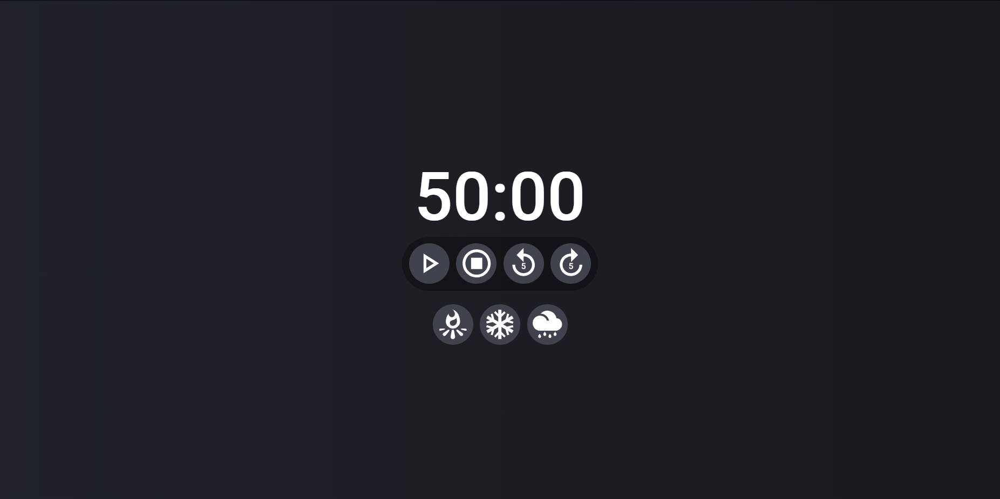
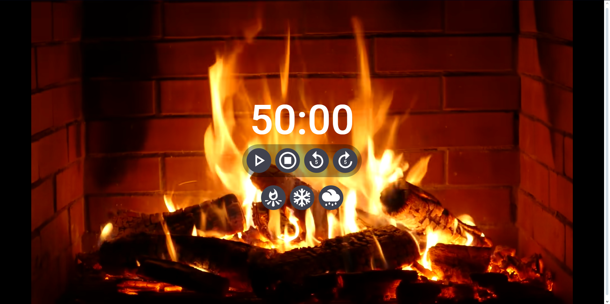

# React Timer &#128345;

Buttons:  
- Play/Pause  
- Reset  
- Decrease 5 minutes  
- Increase 5 minutes  
Plus three buttons to change the background to a youtube video with relaxing ambience sounds.  

## How it was done &#9881;
- React  
- Vite  
- React-player  
- styled-components  
- React-icons  
- React States  

